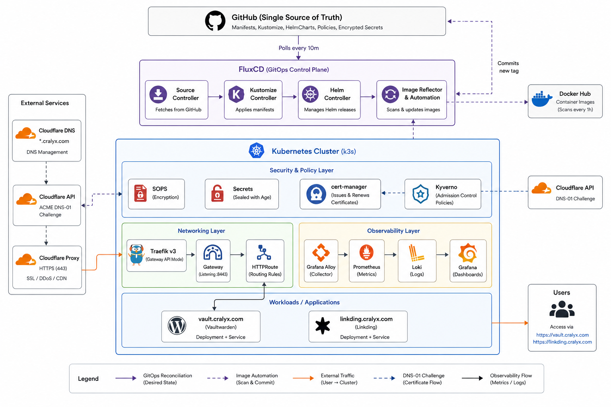
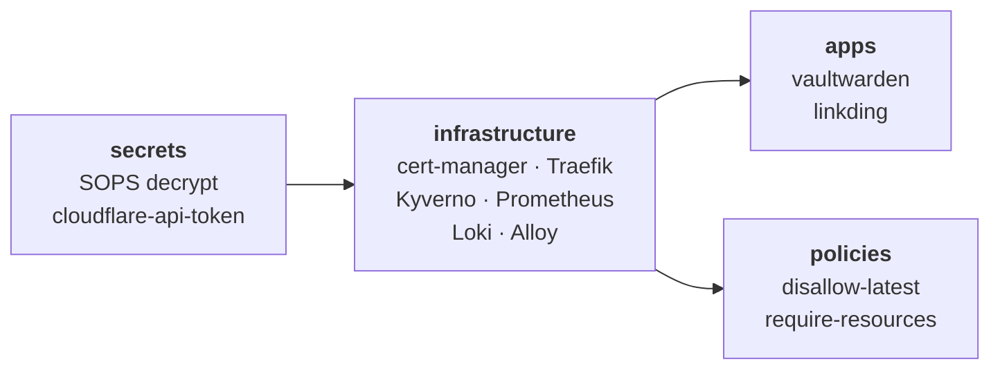
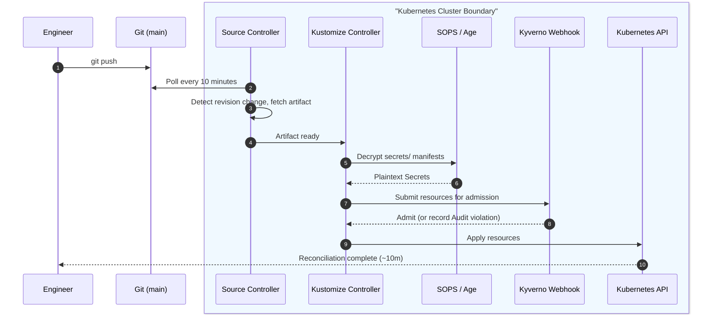
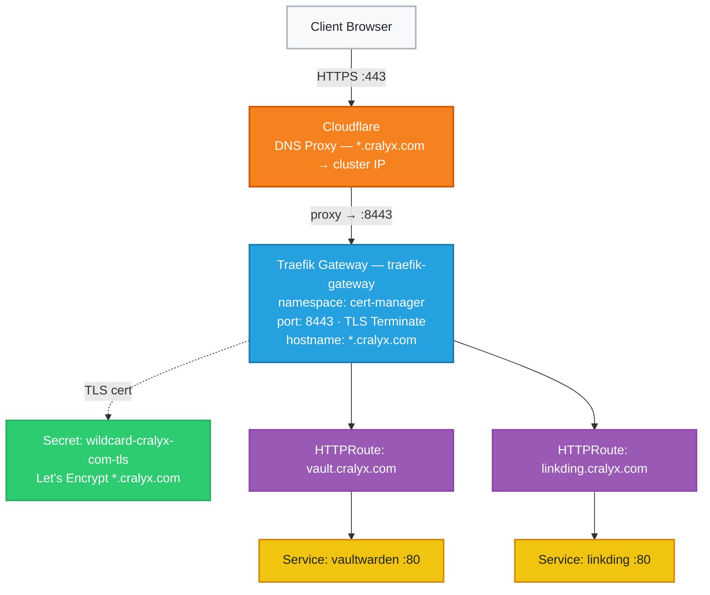
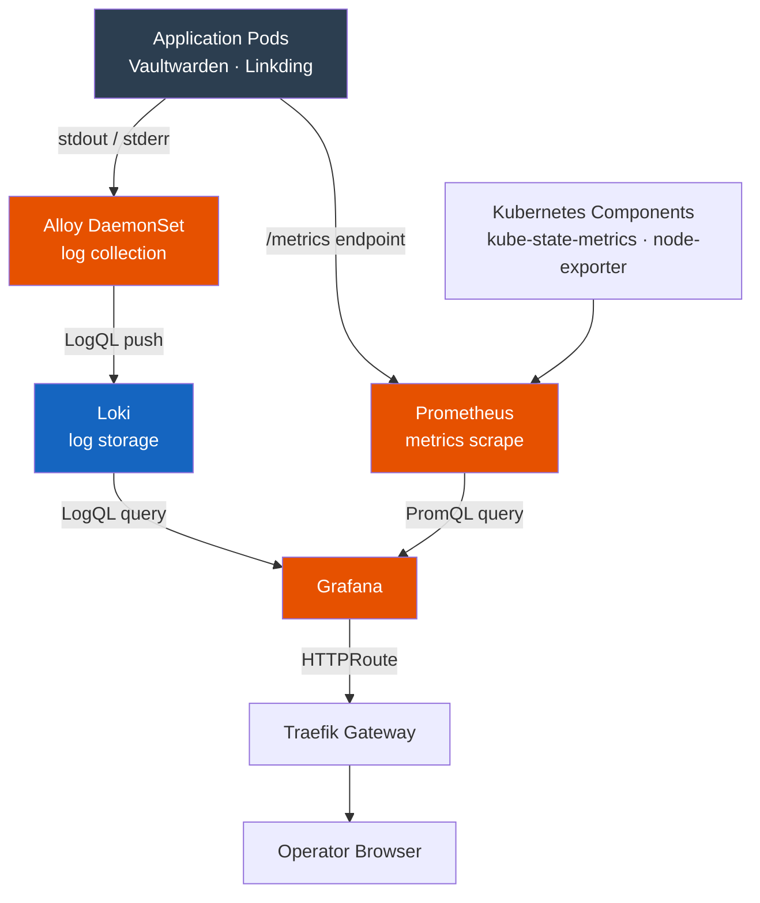
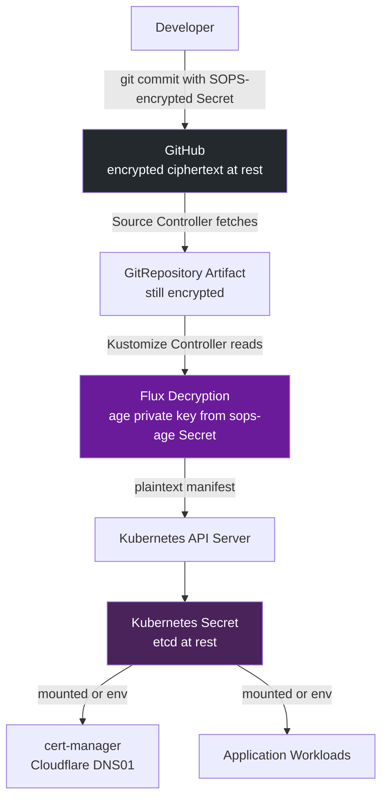

# Cloud-Native Homelab Platform

> A GitOps-managed Kubernetes platform where infrastructure, applications, and policies are defined in Git and continuously reconciled into the cluster.

---
## Table of Contents

- [Executive Summary](#executive-summary)
- [Architecture Overview](#architecture-overview)
- [Component Summary](#component-summary)
- [Repository Structure](#repository-structure)
- [GitOps Workflow](#gitops-workflow)
- [Image Automation](#image-automation)
- [Networking Architecture](#networking-architecture)
- [Observability Stack](#observability-stack)
- [Security Architecture](#security-architecture)
- [Architectural Decisions and Tradeoffs](#architectural-decisions-and-tradeoffs)
- [Known Gaps and Honest Assessment](#known-gaps-and-honest-assessment)

---
## Executive Summary

This repository is the single source of truth for the Cloud-Native Kubernetes platform. It runs on a single-node k3s cluster on Debian 13, managed entirely by FluxCD. No resource is applied manually, namespaces, certificates, deployments, routing rules, secrets, and admission policies are all reconciled from this repository.

The platform hosts two self-hosted workloads: **Vaultwarden** at `vault.cralyx.com` and **Linkding** at `linkding.cralyx.com`. Both are served over HTTPS via Traefik's Gateway API implementation, TLS-terminated with a wildcard Let's Encrypt certificate issued through Cloudflare DNS-01 challenge.

Beyond basic application delivery, the platform runs a **closed-loop image update pipeline**: Flux scans Docker Hub hourly, evaluates new tags against semver range policies, and commits updated image references back to `main`  triggering its own reconciliation. Application updates are deployed without human intervention within the bounds of the defined policy.

Secrets are encrypted with SOPS/Age and committed to the repository. Admission policies are enforced by Kyverno. Metrics and logs flow through kube-prometheus-stack, Loki, and Grafana Alloy into a unified Grafana dashboard. The result is a platform where state is always observable, always in Git, and always reproducible from a fresh OS install.

---
## Architecture Overview

<p align="center">
  
</p>

<p align="center">
  <em>
    High-level architecture showing GitOps reconciliation, security controls,
    networking, observability, and application delivery.
  </em>
</p>

---

## Component Summary

| Component                 | Role                    | Why This Choice                                                                                             |
| ------------------------- | ----------------------- | ----------------------------------------------------------------------------------------------------------- |
| **Debian 13**             | Host OS                 | Stability, long support lifecycle, minimal overhead                                                         |
| **k3s**                   | Kubernetes distribution | Single-binary, production-capable, ships Traefik and CoreDNS; minimal operational overhead                  |
| **FluxCD**                | GitOps engine           | Pull-based reconciliation; image automation built-in; no external CI pipeline required                      |
| **Traefik v3**            | Ingress + Gateway API   | Bundled with k3s; Gateway API support enabled via `HelmChartConfig`; avoids a second ingress controller     |
| **Gateway API**           | Traffic routing         | Supersedes Ingress; clean separation between infrastructure (Gateway) and application (HTTPRoute) ownership |
| **Cloudflare**            | DNS                     | DNS-01 ACME challenge support; wildcard cert issuance without exposing HTTP endpoints publicly              |
| **cert-manager**          | TLS lifecycle           | De facto Kubernetes standard; automatic ACME + Cloudflare integration; handles renewal                      |
| **kube-prometheus-stack** | Metrics + dashboards    | Bundles Prometheus, Grafana, node-exporter, and recording rules in one release                              |
| **Loki**                  | Log aggregation         | Label-indexed; pairs naturally with Kubernetes metadata; native Grafana integration                         |
| **Grafana Alloy**         | Telemetry pipeline      | Unified replacement for Promtail and Grafana Agent; single DaemonSet for logs and metrics                   |
| **Kyverno**               | Admission policies      | Native Kubernetes YAML policies; no Rego required; supports background scanning of existing resources       |
| **SOPS + Age**            | Secret encryption       | Asymmetric encryption; Git-compatible diffs; no external secret store dependency                            |
| **Vaultwarden**           | Password manager        | Self-hosted Bitwarden; critical personal infrastructure                                                     |
| **Linkding**              | Bookmark manager        | Lightweight, minimal resource footprint                                                                     |

---

## Repository Structure


```
.
├── apps/                               # Application workloads — owned by app namespaces
│   ├── kustomization.yaml
│   ├── linkding/
│   │   ├── deployment.yaml             # Namespace, Deployment (pinned image + resource limits), Service
│   │   ├── certificate.yaml
│   │   ├── pvc.yaml                    # PVC → /etc/linkding/data
│   │   └── kustomization.yaml
│   └── vaultwarden/
│       ├── deployment.yaml             # Namespace, Deployment, Service; SIGNUPS_ALLOWED=false
│       ├── certificate.yaml
│       ├── pvc.yaml                    # PVC → /data
│       └── kustomization.yaml
│
├── clusters/
│   └── production/                     # ← single cluster entrypoint
│       ├── kustomization.yaml          # Root composer — references all layer Kustomization CRs
│       ├── flux-system/                # Flux bootstrap manifests (gotk-components, gotk-sync)
│       ├── secrets.yaml                # Kustomization CR: ./secrets · SOPS decrypt enabled
│       ├── infrastructure.yaml         # Kustomization CR: ./infrastructure · dependsOn: secrets
│       ├── policies.yaml               # Kustomization CR: ./policies/kyverno · dependsOn: infrastructure
│       └── apps.yaml                   # Kustomization CR: ./apps · dependsOn: infrastructure
│
├── infrastructure/                     # Platform components — owned by the platform
│   ├── cert-manager/                   # HelmRelease, ClusterIssuer, wildcard Certificate, namespace
│   ├── gateway/                        # Gateway: traefik-gateway · *.cralyx.com
│   ├── kyverno/                        # HelmRelease + namespace
│   ├── logging/                        # Loki HelmRelease + Alloy HelmRelease + namespace
│   ├── monitoring/                     # kube-prometheus-stack HelmRelease, Grafana TLS + routing
│   ├── traefik/                        # HelmChartConfig — enables Gateway API on k3s Traefik
│   └── kustomization.yaml
│
├── policies/
│   └── kyverno/
│       ├── disallow-latest.yaml        # Audit: no :latest image tags
│       ├── require-resources.yaml      # Audit: CPU + memory requests/limits required
│       └── kustomization.yaml
│
├── secrets/
│   ├── cloudflare/
│   │   └── api-token.yaml              # SOPS-encrypted Cloudflare API token
│   └── kustomization.yaml
│
└── .sops.yaml                          # Scope: secrets/**/*.yaml · fields: data + stringData only
```


---

## GitOps Workflow

### Reconciliation Dependency Chain

The reconciliation order is enforced through `dependsOn` declarations in the cluster-layer Kustomization files. Each layer sets `wait: true`, meaning Flux health-checks all resources before proceeding to dependents.



`wait: true` eliminates an entire class of race conditions. Without it: `ClusterIssuer` applied before cert-manager CRDs exist; `HTTPRoute` referencing a Gateway that hasn't started. Both have caused real incidents on this platform.

### Full Reconciliation Sequence



`prune: true` is set on every Kustomization. Resources removed from Git are automatically deleted from the cluster on the next cycle, no manual cleanup, no resource accumulation over time.

---
## Image Automation

The image automation pipeline creates a fully closed update loop. New container versions are discovered, policy-evaluated, committed to Git, and deployed without any human action.

### The Setter Annotation

The `ImageUpdateAutomation` controller uses the `Setters` strategy, scanning the repository for structured marker comments and rewriting the image tag in-place:

```yaml
# apps/vaultwarden/deployment.yaml
image: vaultwarden/server:1.36.0 # {"$imagepolicy": "flux-system:vaultwarden"}

# apps/linkding/deployment.yaml
image: sissbruecker/linkding:1.45.0 # {"$imagepolicy": "flux-system:linkding"}
```

### Policy Scope

| App | Image | Policy range | Auto-deploys | Requires manual review |
|---|---|---|---|---|
| Vaultwarden | `vaultwarden/server` | `1.x` | Any `1.y.z` release | `2.0.0` and above |
| Linkding | `sissbruecker/linkding` | `1.x` | Any `1.y.z` release | `2.0.0` and above |

The `1.x` upper bound is the deliberate control point. Major version bumps may carry breaking schema changes or data migration requirements. They require a human to review the changelog, update the policy range, and explicitly accept the upgrade.

###### Relationship to Kyverno's `disallow-latest`

Image automation and the Kyverno `disallow-latest` policy are mutually reinforcing. Automation ensures all production images carry pinned semver tags, exactly what the policy requires. Kyverno acts as an independent, synchronous check: if a `:latest` tag were ever committed manually, it generates an audit violation in `PolicyReport` before it could be acted on.

---

## Networking Architecture

### Traffic Flow



### Gateway API — Infrastructure vs Application Ownership

The move from `Ingress` to Gateway API is an ownership boundary, not just an API upgrade. Platform engineers own the `Gateway`  what hostnames are exposed, on what ports, with what TLS configuration. Application owners own the `HTTPRoute`  how traffic to their hostname reaches their Service. Neither can override the other. The API enforces the boundary.

`allowedRoutes.namespaces.from: All` is correct for a single-operator platform where every namespace is trusted. A multi-team environment would use `from: Selector` with namespace label constraints.

**A non-obvious constraint:** k3s's Traefik maps named entrypoints (`web`, `websecure`) to internal ports `8000` and `8443`  not the external service ports `80` and `443`. Gateway API listeners must use the **internal entrypoint port**. Using `port: 443` in the listener spec causes listener validation to fail because Traefik's Gateway controller matches listeners by entrypoint port, not service port. The correct configuration is `port: 8443` in the Gateway listener with `hostPort: 443` in the `HelmChartConfig` the external port and the listener port are intentionally different.

`hostPort` binds Traefik directly to the node's network interface, bypassing the need for a `LoadBalancer` Service or MetalLB.

---

## Observability Stack



**Prometheus** (via `kube-prometheus-stack`) scrapes metrics from all platform components Flux controllers, Traefik, Kyverno, node-level metrics via `node-exporter` using `PodMonitor` and `ServiceMonitor` resources for service discovery.

**Grafana Alloy** runs as a `DaemonSet`, tailing container logs from every pod and enriching streams with Kubernetes metadata (`namespace`, `pod`, `container`) before forwarding to Loki. These labels become the primary dimensions for log queries, which maps naturally to how Kubernetes workloads are reasoned about during incidents.

**Loki** stores logs in a label-indexed format. It does not perform full-text indexing, the query model is optimised for the label-scoped filtering that Kubernetes log analysis naturally uses.

**Grafana** is the unified observability frontend with Prometheus and Loki configured as data sources. The logging and monitoring stacks are kept in separate namespaces (`logging` and `monitoring`) to allow independent lifecycle management, upgrading Loki does not require touching the Prometheus stack.

---

## Security Architecture



### Admission Control: Kyverno

**`disallow-latest-tag`** rejects any Pod where a container uses the `:latest` image tag. Mutable tags make the running image unauditable, you cannot determine what code is running from the manifest, and you cannot roll back to a known state. All platform workloads satisfy this policy because image automation enforces pinned semver tags as process.

**`require-resource-requests-limits`** rejects any Pod where a container omits CPU or memory `requests` and `limits`. Without limits, a misbehaving container can exhaust node resources and starve every other workload. On a single-node cluster this means full platform outage.

Both policies use `validationFailureAction: Audit` with `background: true`. Audit mode records violations in `PolicyReport` resources without blocking admission, the correct posture while infrastructure Helm charts are being audited for compliance. `background: true` re-evaluates existing resources continuously.

```bash
# Inspect current policy compliance across all namespaces
kubectl get policyreport -A
kubectl describe clusterpolicyreport
```

### TLS and Application Security

All public endpoints are HTTPS-only. No HTTP application endpoint is exposed to the public internet. The wildcard certificate is issued and renewed by cert-manager automatically. Vaultwarden is configured with `SIGNUPS_ALLOWED=false` the instance accepts no new registrations and serves a known, fixed set of users.

---
## Architectural Decisions and Tradeoffs

| Architectural Decision | Rationale | Accepted Tradeoff |
| --- | --- | --- |
| k3s Built-in Traefik via `HelmChartConfig` | Avoids controller ownership conflicts with k3s's internal Helm controller. Reduces the total number of controllers running in the cluster. | Upgrades are tied directly to k3s releases. Uses a blunt `reinstall` failure policy rather than a graceful rollback mechanism. |
| Wildcard Certificate (`*.cralyx.com`) | Frictionless iteration; adding a subdomain requires only an `HTTPRoute`. Avoids ACME rate limits and reduces secret management overhead to a single object. | Shared blast radius if the certificate is compromised. Constrains Gateway placement to co-locate with the TLS secret or requires a cross-namespace `ReferenceGrant`. |
| SOPS/Age vs External Secrets Operator | Completely self-contained cluster capable of being reconstructed offline. No external runtime dependencies. Secret history is highly auditable in Git. | Key rotation is a bulk operation requiring re-encryption of all files. Lacks the per-access audit logging that a system like HashiCorp Vault provides. |
| Image Automation Committing Directly to `main` | Eliminates manual toil for safe minor/patch updates within defined policy boundaries (e.g., `1.x`). Fulfills the goal of continuous, human-free reconciliation. | Removes the review gate between an upstream Docker Hub tag and a running container. A compromised upstream image could deploy automatically. |
| Kyverno Policies in `Audit` Mode | Prevents strict `Enforce` policies from blocking third-party infrastructure Helm charts from coming up during the initial bootstrap phase. | Non-compliant pods can run without being blocked. Relies on the operator to actively review the `PolicyReport` and adjust values before flipping to `Enforce`. |

---
## Current Limitations and Next Steps

| Gap | Planned Resolution |
|------|------|
| Kyverno policies in `Audit`, not `Enforce` | Audit chart defaults and gradually promote policies to `Enforce` once all workloads are compliant |
| `allowedRoutes.namespaces.from: All` | Move to namespace selectors if additional teams or untrusted namespaces are introduced |
| Image automation commits directly to `main` | Introduce Cosign verification and potentially a PR-based workflow for higher-risk workloads |
| Single-node cluster | Add additional nodes and migrate to an HA control plane when availability becomes a requirement |
| No image signature verification | Implement Cosign and Kyverno `verifyImages` policies |
| No PVC backup strategy | Introduce Velero with an S3-compatible backend for backup and recovery |
